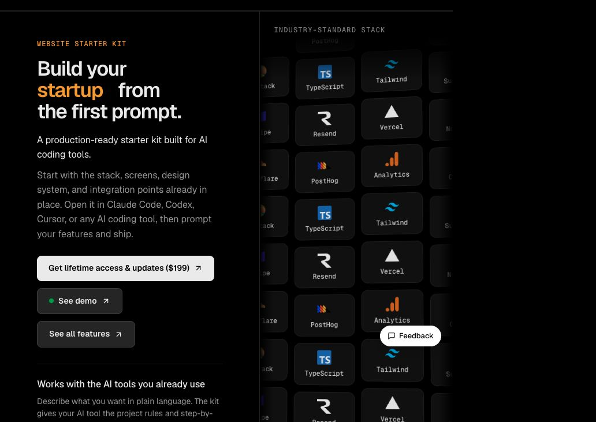
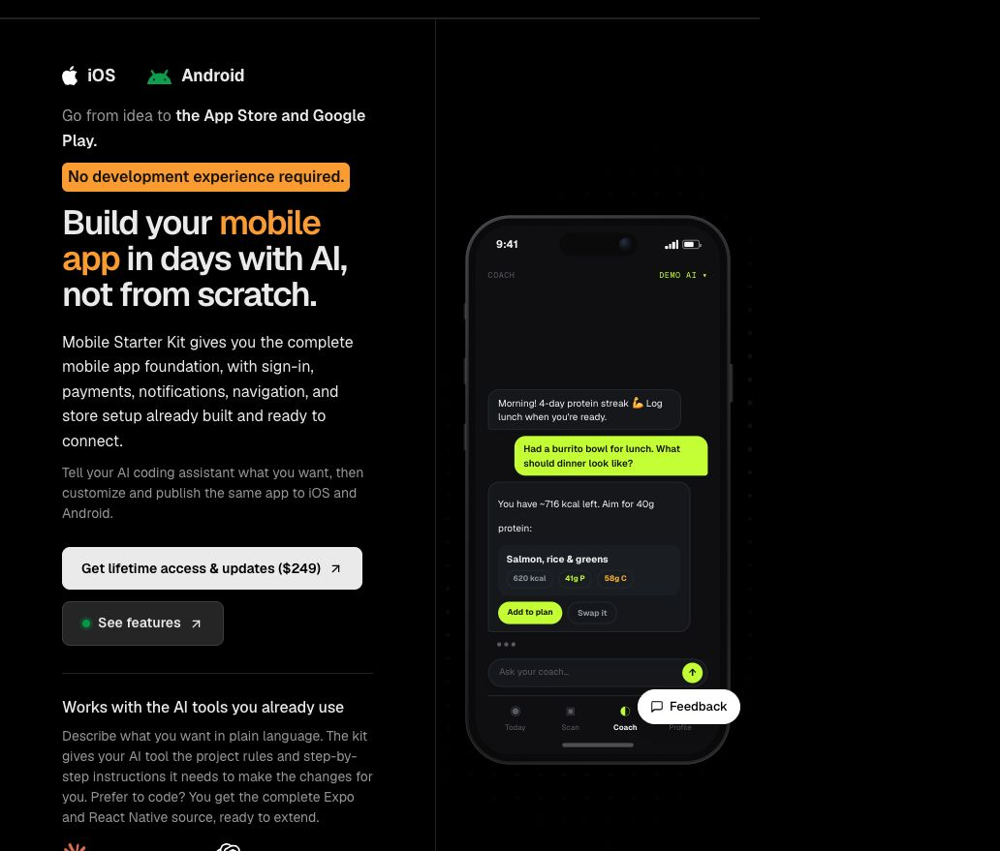

# Landing Page Templates for Products That Need More Than a Homepage

Search for **landing page templates** and most results solve the same problem: they give you a hero, a few feature cards, a pricing section, and a footer.

That can be exactly enough. If you need one page to collect emails or explain a service, a finished HTML template is a sensible shortcut.

It becomes less useful when the button at the top is supposed to open a product. The landing page may be finished, but sign-in, billing, onboarding, dashboards, notifications, analytics, and deployment are still waiting behind it.

The useful question is not which template has the nicest preview. It is what should happen after someone clicks the main button.

## Start with the click

Imagine the page is live. A visitor understands the product and clicks the primary action.

If the next step is an email form, booking page, or download, a conventional landing page template may be all you need. Keep the project small.

If the next step is an account, subscription, dashboard, or installed app, the landing page is only the first screen of a larger system. Starting from a template still saves time, but it does not remove much of the setup work.

There are two common versions of that problem:

| What you are building | What sits behind the landing page |
| --- | --- |
| A SaaS product, web app, or AI tool | Authentication, billing, product screens, email, content, and analytics |
| An iOS and Android app | Sign-in, onboarding, navigation, subscriptions, notifications, and store releases |

This README looks at those two cases through two paid starter kits from getdesign.md. Both include the public-facing page as part of a larger product codebase. If all you need is a static landing page, neither is the right fit.

## For a web app or SaaS product

[](https://getdesign.md/website-starter-kit)

The [Website Starter Kit](https://getdesign.md/website-starter-kit) is for browser-based products where the landing page needs to lead into a working application.

The codebase includes the marketing site, authentication, payments, AI chat and knowledge search, email, analytics, file uploads, multi-language support, and the content pages a product usually needs after launch. Blog, documentation, legal pages, SEO, and LLMO are part of the same project rather than separate tasks for later.

It also includes a private `DESIGN.md`, a component library, and shared visual rules. That matters once the project grows past the homepage. Your coding assistant does not have to infer the button style, spacing rhythm, and surface colors from one finished screenshot every time it adds a screen.

This is more foundation than a brochure site needs. If the whole project is one page and a contact form, it is unnecessary. It makes sense when the plan already includes accounts, subscriptions, a dashboard, or several product surfaces.

### What is already covered

- Landing page and marketing surfaces
- Authentication, social login, and roles
- Payments and subscription billing
- AI chat and knowledge search
- Blog, documentation, legal pages, SEO, and LLMO
- Email, newsletter, contact form, GA4, and PostHog
- File uploads, notifications, and multi-language support
- A private `DESIGN.md`, design system, and component library
- Deployment setup and guides for AI coding tools

The complete source is included. It is a one-time purchase rather than a hosted platform subscription, although hosting and any third-party services are still separate.

## For an iOS and Android app

[](https://getdesign.md/mobile-starter-kit)

A mobile app has a different version of the same gap. A mobile landing page template can explain the app and link to the stores, but it cannot give you the app that belongs in those stores.

The [Mobile Starter Kit](https://getdesign.md/mobile-starter-kit) starts with the application itself. It is one Expo and React Native codebase for iOS and Android, with the common flows already running on sample data.

Sign-in, onboarding, navigation, push notifications, deep links, offline sync, and a Supabase-ready data layer are already represented. Subscription flows include paywalls, Free and Pro states, purchase management, restore purchases, offers, and the points needed to connect RevenueCat.

There are also working interface patterns for streaming AI chat and camera-to-AI results. They do not decide what your app does. They give your coding assistant real screens and states to change instead of an empty navigation tree.

The native design system includes shared tokens, themes, NativeWind, dark mode, accessible states, and more than 30 reusable components. EAS Build, over-the-air updates, monitoring, analytics, store assets, and App Store and Google Play workflows cover the less visible part of shipping.

### What is already covered

- Expo and React Native source for iOS and Android
- Sign-in, onboarding, account flows, and navigation
- Push notifications, deep links, and native device features
- Supabase-ready data layer and offline sync
- Paywalls, subscription states, and RevenueCat connection points
- Streaming AI chat and camera-to-AI flows
- Shared design tokens, themes, and 30+ native components
- PostHog, Sentry, EAS Build, and over-the-air updates
- App Store and Google Play release workflows

The source can be used for personal, commercial, and client apps. Apple and Google developer accounts and third-party services are not included.

## Website or mobile?

The choice is mostly about where the main product lives.

Choose the Website Starter Kit when people will do the real work in a browser. That includes SaaS tools, customer portals, AI products, internal tools, and products where content or desktop workflows matter.

Choose the Mobile Starter Kit when the product depends on an installed app, push notifications, camera access, native behavior, or subscriptions through the app stores.

Some products need both. In that case the website handles discovery, content, and perhaps a browser version of the product, while the mobile codebase handles the installed experience. Sharing the same brand direction is useful; forcing both platforms into the same interaction patterns is not.

| | Website Starter Kit | Mobile Starter Kit |
| --- | --- | --- |
| Main platform | Browser | iOS and Android |
| Foundation | Web application and marketing site | Expo and React Native app |
| Access | Complete source | Complete source |
| Design context | Private `DESIGN.md` and web component system | Native tokens, themes, and reusable components |
| Payments | Web payments and subscriptions | App subscriptions and entitlement states |
| Release path | Web deployment | EAS, App Store, Google Play, and OTA updates |

## What these replace, and what they do not

Both kits replace a chunk of repetitive product setup. They give an AI coding tool existing routes, components, states, and project rules to work with.

They do not replace product decisions. You still need to decide who the product is for, what the first useful action is, what belongs in the free and paid plans, and why anyone should care. The demo content is a starting point, not research.

They also do not include the accounts behind external services. Hosting, email delivery, analytics, payment providers, AI models, Apple and Google developer accounts, and usage fees remain your responsibility.

This distinction is worth making because a large starter can create false confidence. Having an authentication screen does not mean the onboarding is right. Having a pricing table does not mean the plans make sense. The kit removes plumbing; it does not validate the product.

## Using the kits with an AI coding tool

The best first prompt is not "make this look like my startup." Give the tool the product constraints and one contained job.

For a web product:

```text
Read the project guides and DESIGN.md before editing the UI.

Turn the existing marketing site into a customer research product for small teams.
Rewrite the landing page around interview notes and searchable insights.
Keep the current authentication and billing foundation.
Adapt the first dashboard view for projects, interviews, and tagged findings.
```

For a mobile product:

```text
Read the project rules before changing the app.

Adapt the starter into a daily language practice app.
Keep the existing sign-in, subscription, notification, and navigation flows.
Replace the sample content with lessons, streaks, and speaking exercises.
Use the existing native components and tokens for both iOS and Android.
```

Work through one complete flow at a time. Landing page to sign-up is a useful first slice for the web. Onboarding to the first completed action is a useful first slice on mobile. A smaller scope makes it easier to see what the assistant misunderstood.

## What to check before you commit

Even a large starter should be judged with the same skepticism as a small template.

**Run it before planning around it.** Click through the existing screens and check which flows use sample data, which integrations are connected, and which need your credentials.

**Read the project structure.** Your AI tool will edit the code, but you still want clear boundaries between content, components, data, and integrations.

**Try your real copy.** Demo pages are designed around neat headlines and balanced feature lists. Your product description will be messier. Put it in early.

**Check the platform you will ship.** For the website, test mobile layouts, metadata, forms, and deployment. For the app, test both iOS and Android, purchase states, permissions, deep links, and store requirements.

**Count what you will remove.** Starting with more is useful only when the included parts overlap with the product you intend to build.

## Frequently asked questions

### Are these free landing page templates?

No. They are paid starter kits with complete source code, product flows, design systems, and lifetime access or updates. If you only need a static page, they are more than you need.

### Do I need to be a developer?

No. The projects include instructions for AI coding tools such as Claude Code, Codex, Cursor, and Gemini CLI. Development knowledge still helps when reviewing integrations, security, payments, and release settings.

### Can I change the landing page design?

Yes. The existing design systems are there to keep changes consistent, not to lock the project to the demo. You can change the typography, colors, content, layout, components, and product screens.

### Can I use the Website Starter Kit for a simple company website?

You can, but it may be unnecessary. Its value is the application foundation behind the site. For a small brochure site with no accounts or payments, a lighter landing page template is usually the better fit.

### Does the Mobile Starter Kit build for both app stores?

Yes. The Expo and React Native codebase targets iOS and Android, and the kit documents App Store and Google Play workflows.

### Is either kit a subscription?

No. Both use a one-time purchase model. Provider fees, hosting, usage costs, and developer accounts are separate.

## Pick based on the product behind the page

The visual style of a landing page is easy to compare because it is visible. The expensive part is usually what the preview leaves out.

If the product ends at the form, choose a small template and ship it. If the page opens into a web application, the [Website Starter Kit](https://getdesign.md/website-starter-kit) covers more of the work that follows. If it opens into an iOS or Android product, the [Mobile Starter Kit](https://getdesign.md/mobile-starter-kit) starts on the other side of the download button.

Choose based on the first month after launch, not the first screenshot.
